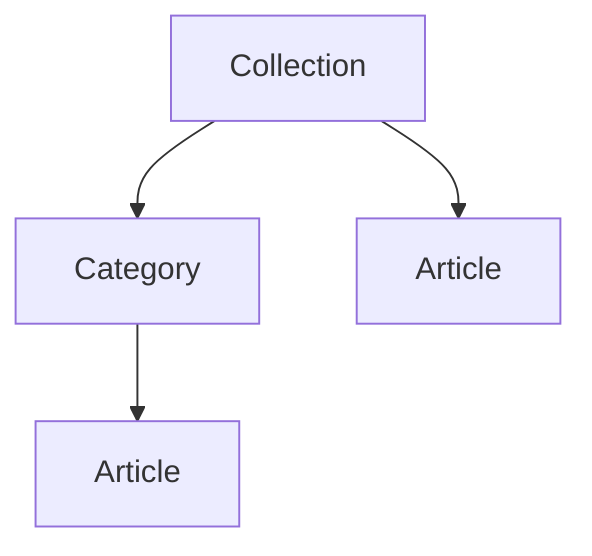

A **collection** is the top level of your Help Center — a broad topic area such as "Getting Started" or "Billing" that users see first on your help center home page. Collections hold [categories](/api-reference/help-categories/overview), and categories hold [articles](/api-reference/help-articles/overview).



An article can be filed **either** inside a category **or** directly inside a collection, so a standalone topic doesn't need a category of its own.

<Callout kind="alert">
  **Every Help Center endpoint requires the `knowledgebase` feature on your plan** — reads included, not just writes. Calls from an organization without it return `403`. This is stricter than the dashboard, which keeps reads available after a downgrade.
</Callout>

## The help collection object

<ResponseField name="id" field-type="string" required="true" deprecated="false">
  A unique identifier for the collection (UUID).
</ResponseField>

<ResponseField name="name" field-type="string" required="true" deprecated="false">
  The display name shown on your help center home page.
</ResponseField>

<ResponseField name="slug" field-type="string" required="true" deprecated="false">
  URL-safe identifier, unique within your organization. Forms the first segment of an article's public URL: `/help/{collection_slug}/...`
</ResponseField>

<ResponseField name="description" field-type="string" required="false" deprecated="false">
  Optional supporting text shown beneath the collection name. May be `null`.
</ResponseField>

<ResponseField name="icon" field-type="string" required="false" deprecated="false">
  Optional icon identifier rendered next to the collection. May be `null`.
</ResponseField>

<ResponseField name="color" field-type="string" required="false" deprecated="false">
  Optional hex color string (e.g. `"#4E938A"`) used as an accent. May be `null`.
</ResponseField>

<ResponseField name="seq_number" field-type="string" required="false" deprecated="false">
  The collection's position in the curated order, as a decimal string. **Read-only** — see [Ordering](#ordering) below.
</ResponseField>

<ResponseField name="category_count" field-type="integer" required="true" deprecated="false">
  How many active categories this collection contains.
</ResponseField>

<ResponseField name="created_at" field-type="string" required="true" deprecated="false">
  ISO 8601 timestamp at which the collection was created.
</ResponseField>

<ResponseField name="updated_at" field-type="string" required="true" deprecated="false">
  ISO 8601 timestamp of the most recent change.
</ResponseField>

## Example help collection object

```json
{
  "id": "553c3ef8-b8cd-cd15-01ba-12bb12bb12bb",
  "name": "Getting Started",
  "slug": "getting-started",
  "description": "Set up your account and learn the basics.",
  "icon": "rocket",
  "color": "#4E938A",
  "seq_number": "1000.0000",
  "category_count": 4,
  "created_at": "2026-08-01T10:12:00",
  "updated_at": "2026-08-04T09:30:00"
}
```

## Slugs

Every collection has a slug that is unique within your organization. Omit `slug` when creating and one is derived from `name`; if that slug is already taken, a unique suffix is appended automatically so creation never fails on a collision.

Updating behaves differently: an explicit `slug` that is already in use is **rejected with `400`** rather than silently suffixed, because a caller renaming a slug means that exact slug.

Deleting a collection frees its slug for reuse.

## Ordering

`seq_number` controls the order collections appear in on your help center, and is **read-only through the API**. New collections are appended to the end.

Reordering is a dashboard-only operation: it uses drag-and-drop, whose contract is "place this item between these two neighbours", which assumes the caller can already see the list. Reorder collections in the ProductBridge dashboard under **Help Center**.

## Deleting

Deletes are **soft and cascade downward**. Deleting a collection also soft-deletes its categories and every article inside them. Nothing is permanently removed, and the freed slugs become available again.

## What you can do

<Columns cols="2">
  <Card title="Retrieve a collection" href="/api-reference/help-collections/retrieve" icon="search" horizontal="false">
    Look up a single collection by its UUID, including its category count.
  </Card>

  <Card title="List collections" href="/api-reference/help-collections/list" icon="list" horizontal="false">
    Page through every collection in your organization, in curated order.
  </Card>

  <Card title="Create a collection" href="/api-reference/help-collections/create" icon="plus" horizontal="false">
    Add a new top-level topic area to your Help Center.
  </Card>

  <Card title="Update a collection" href="/api-reference/help-collections/update" icon="pencil" horizontal="false">
    Rename, recolor, or re-slug an existing collection.
  </Card>

  <Card title="Delete a collection" href="/api-reference/help-collections/delete" icon="trash-2" horizontal="false">
    Soft-delete a collection along with its categories and articles.
  </Card>
</Columns>
