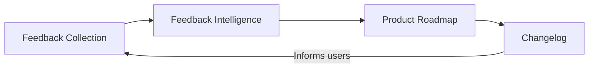

## The Four Pillars of ProductBridge

ProductBridge is built around four interconnected pillars that form a complete product management workflow. Each pillar handles a specific stage of the feedback-to-feature lifecycle, and together they give you a continuous loop from user input to product output.

## Feedback Collection

Feedback Collection is your single inbox for every piece of user input. ProductBridge gathers feedback from a public portal, in-app widgets, and automatic ingestion from third-party tools — so nothing falls through the cracks.

You stop juggling Intercom, emails, and Slack threads. Every request, complaint, and suggestion lives in one place, tagged and searchable.

<Card title="Feedback Collection" href="/core-concepts/feedback-collection" icon="message-square" horizontal="false">
  Learn about the three feedback channels: Public Portal, In-App Widgets, and Auto-Ingestion.
</Card>

## Feedback Intelligence

Raw feedback is only useful if you can make sense of it. Feedback Intelligence uses AI to automatically categorize feedback, detect sentiment, identify trends, and surface patterns you would otherwise miss.

You can also ask natural language questions about your data and get instant, actionable answers.

<Columns cols="2">
  <Card title="Ask AI" href="/core-concepts/feedback-intelligence/ask-ai" icon="sparkles" horizontal="false">
    Ask questions about your feedback in plain English and get AI-powered answers.
  </Card>

  <Card title="Intelligence Dashboard" href="/core-concepts/feedback-intelligence/dashboard" icon="bar-chart-3" horizontal="false">
    Explore trends, sentiment analysis, and categorization across all your feedback.
  </Card>
</Columns>

## Product Roadmap

The Product Roadmap turns insights into plans. Link feedback directly to roadmap items so every feature you build is backed by real user demand. Share your roadmap publicly to build trust, or keep it internal for team alignment.

Prioritize with confidence — you always know which features matter most to your users.

<Card title="Product Roadmap" href="/core-concepts/product-roadmap" icon="map" horizontal="false">
  Learn how to plan, prioritize, and share your product roadmap.
</Card>

## Changelog

The Changelog closes the loop between you and your users. Publish product updates, announce new features, and document fixes so your users always know what is new and what is coming.

A transparent changelog builds trust and reduces support volume by proactively answering "when will this be fixed?"

<Card title="Changelog" href="/core-concepts/changelog" icon="megaphone" horizontal="false">
  Learn how to publish product updates and release notes.
</Card>

## How the Pillars Work Together

<Callout kind="info" collapsed="false">
  The four pillars are not isolated features — they form a continuous cycle. Feedback flows into Intelligence, which informs your Roadmap, which gets communicated through the Changelog, which drives new feedback. This loop ensures your product decisions are always grounded in what users actually need.
</Callout>

