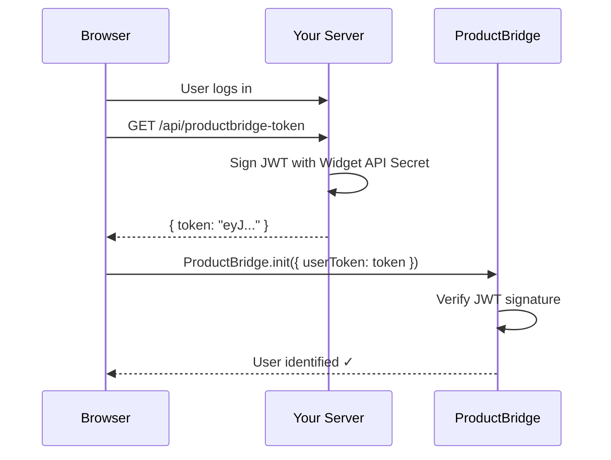

## Why Identify Users?

By default the widget works anonymously. When you add identity verification:

- Feedback is automatically linked to the real user's profile — name, email, company, and plan
- Your team sees **who** submitted each piece of feedback, not just what they said
- Duplicate detection and user segmentation work immediately — no manual tagging
- Users skip the login prompt inside the widget

## How It Works



1. **Your server** generates a short-lived JWT signed with your Widget API Secret
2. **Your frontend** fetches that token and passes it to `ProductBridge.init()` as `userToken`
3. **ProductBridge** verifies the signature and logs the user in automatically

The JWT is signed server-side so the widget can trust its contents. Your Widget API Secret **never** leaves your server.

## Step 1 — Create a Widget API Key

<Steps>
  <Step title="Open Widget Settings" icon="settings" title-type="p">
    In your ProductBridge dashboard go to **Settings > Widget & Embeds > API Keys**.
  </Step>

  <Step title="Generate a new key" icon="key" title-type="p">
    Click **Generate API Key**, give it a name (e.g. `production`), and copy the secret.

    <Callout kind="danger" collapsed="false">
      The full secret is shown **only once**. Copy it now and store it in your server's environment variables. If you lose it, generate a new one.
    </Callout>
  </Step>

  <Step title="Store it server-side" icon="server" title-type="p">
    Add the secret to your environment — never commit it to source control or expose it in client-side code:

    ```bash
    PRODUCTBRIDGE_WIDGET_SECRET=your_64_char_hex_secret
    ```
  </Step>
</Steps>

## Step 2 — Generate the JWT on Your Server

Create an endpoint on your backend that returns a short-lived JWT. The widget calls this endpoint after the user logs in.

<CodeGroup tabs="Node.js, Python, PHP, Ruby, Go">
```javascript title="token.js (Express)"
const jwt = require('jsonwebtoken');
// npm install jsonwebtoken

const PRODUCTBRIDGE_SECRET = process.env.PRODUCTBRIDGE_WIDGET_SECRET;

function generateProductBridgeToken(user) {
  return jwt.sign(
    {
      // --- Required ---
      email: user.email,

      // --- Recommended ---
      name: user.name,
      sub: String(user.id),          // your internal user ID
      avatar_url: user.avatarUrl,

      // --- Optional: Company & Plan data ---
      company_name: user.companyName,
      company_id: String(user.companyId),
      company_mrr: user.mrr,         // monthly recurring revenue (number)
      customer_status: user.status,  // e.g. "active", "trial", "churned"
      renewal_date: user.renewalDate, // ISO date string
      renewal_risk: user.renewalRisk, // e.g. "low", "medium", "high"
    },
    PRODUCTBRIDGE_SECRET,
    {
      expiresIn: '1h',
      algorithm: 'HS256',
    }
  );
}

// Express route
app.get('/api/productbridge-token', requireAuth, (req, res) => {
  const token = generateProductBridgeToken(req.user);
  res.json({ token });
});
```

```python title="token.py (Flask / Django)"
import jwt
import os
from datetime import datetime, timedelta, timezone
# pip install PyJWT

PRODUCTBRIDGE_SECRET = os.environ['PRODUCTBRIDGE_WIDGET_SECRET']

def generate_productbridge_token(user):
    payload = {
        # --- Required ---
        'email': user['email'],

        # --- Recommended ---
        'name': user.get('name'),
        'sub': str(user['id']),          # your internal user ID
        'avatar_url': user.get('avatar_url'),

        # --- Optional: Company & Plan data ---
        'company_name': user.get('company_name'),
        'company_id': str(user['company_id']) if user.get('company_id') else None,
        'company_mrr': user.get('mrr'),
        'customer_status': user.get('status'),  # "active", "trial", "churned"
        'renewal_date': user.get('renewal_date'),
        'renewal_risk': user.get('renewal_risk'),

        # --- Token lifetime ---
        'exp': datetime.now(tz=timezone.utc) + timedelta(hours=1),
    }
    return jwt.encode(payload, PRODUCTBRIDGE_SECRET, algorithm='HS256')


# Flask route
@app.route('/api/productbridge-token')
@login_required
def productbridge_token():
    token = generate_productbridge_token(current_user)
    return jsonify({'token': token})
```

```php title="token.php (Laravel / Slim)"
<?php
// composer require firebase/php-jwt
use Firebase\JWT\JWT;

$secret = getenv('PRODUCTBRIDGE_WIDGET_SECRET');

function generateProductBridgeToken(array $user): string
{
    global $secret;

    $payload = [
        // --- Required ---
        'email'           => $user['email'],

        // --- Recommended ---
        'name'            => $user['name'] ?? null,
        'sub'             => (string) $user['id'],
        'avatar_url'      => $user['avatar_url'] ?? null,

        // --- Optional: Company & Plan data ---
        'company_name'    => $user['company_name'] ?? null,
        'company_id'      => isset($user['company_id']) ? (string) $user['company_id'] : null,
        'company_mrr'     => $user['mrr'] ?? null,
        'customer_status' => $user['status'] ?? null,
        'renewal_date'    => $user['renewal_date'] ?? null,
        'renewal_risk'    => $user['renewal_risk'] ?? null,

        // --- Token lifetime ---
        'iat'             => time(),
        'exp'             => time() + 3600,  // 1 hour
    ];

    return JWT::encode($payload, $secret, 'HS256');
}

// Laravel controller
public function productbridgeToken(Request $request): JsonResponse
{
    $token = generateProductBridgeToken($request->user()->toArray());
    return response()->json(['token' => $token]);
}
```

```ruby title="token.rb (Rails / Sinatra)"
require 'jwt'
# gem 'jwt'

PRODUCTBRIDGE_SECRET = ENV['PRODUCTBRIDGE_WIDGET_SECRET']

def generate_productbridge_token(user)
  payload = {
    # --- Required ---
    email: user[:email],

    # --- Recommended ---
    name: user[:name],
    sub: user[:id].to_s,
    avatar_url: user[:avatar_url],

    # --- Optional: Company & Plan data ---
    company_name: user[:company_name],
    company_id: user[:company_id]&.to_s,
    company_mrr: user[:mrr],
    customer_status: user[:status],      # "active", "trial", "churned"
    renewal_date: user[:renewal_date],
    renewal_risk: user[:renewal_risk],

    # --- Token lifetime ---
    exp: Time.now.to_i + 3600,           # 1 hour
  }.compact                              # remove nil values

  JWT.encode(payload, PRODUCTBRIDGE_SECRET, 'HS256')
end

# Rails controller
def productbridge_token
  token = generate_productbridge_token(current_user.attributes.symbolize_keys)
  render json: { token: token }
end
```

```go title="token.go"
package main

import (
    "net/http"
    "os"
    "time"

    "github.com/golang-jwt/jwt/v5"
    // go get github.com/golang-jwt/jwt/v5
)

var productBridgeSecret = []byte(os.Getenv("PRODUCTBRIDGE_WIDGET_SECRET"))

type ProductBridgeClaims struct {
    Email          string  `json:"email"`
    Name           string  `json:"name,omitempty"`
    AvatarURL      string  `json:"avatar_url,omitempty"`
    CompanyName    string  `json:"company_name,omitempty"`
    CompanyID      string  `json:"company_id,omitempty"`
    CompanyMRR     float64 `json:"company_mrr,omitempty"`
    CustomerStatus string  `json:"customer_status,omitempty"`
    RenewalDate    string  `json:"renewal_date,omitempty"`
    RenewalRisk    string  `json:"renewal_risk,omitempty"`
    jwt.RegisteredClaims
}

func generateProductBridgeToken(user User) (string, error) {
    claims := ProductBridgeClaims{
        Email:          user.Email,
        Name:           user.Name,
        AvatarURL:      user.AvatarURL,
        CompanyName:    user.CompanyName,
        CompanyID:      user.CompanyID,
        CompanyMRR:     user.MRR,
        CustomerStatus: user.Status,
        RenewalDate:    user.RenewalDate,
        RenewalRisk:    user.RenewalRisk,
        RegisteredClaims: jwt.RegisteredClaims{
            Subject:   user.ID,
            ExpiresAt: jwt.NewNumericDate(time.Now().Add(time.Hour)),
            IssuedAt:  jwt.NewNumericDate(time.Now()),
        },
    }
    token := jwt.NewWithClaims(jwt.SigningMethodHS256, claims)
    return token.SignedString(productBridgeSecret)
}

// HTTP handler
func productBridgeTokenHandler(w http.ResponseWriter, r *http.Request) {
    user := getCurrentUser(r) // your auth middleware
    token, err := generateProductBridgeToken(user)
    if err != nil {
        http.Error(w, "token generation failed", http.StatusInternalServerError)
        return
    }
    w.Header().Set("Content-Type", "application/json")
    w.Write([]byte(`{"token":"` + token + `"}`))
}
```
</CodeGroup>

## Step 3 — Pass the Token to the Widget

Fetch the token from your backend and pass it as `userToken` in `ProductBridge.init()`. Choose your frontend framework:

<CodeGroup tabs="HTML/JS, React, Vue, Angular">
```html title="index.html"
<script>
  (function () {
    // 1. Fetch the token from your backend
    fetch('/api/productbridge-token')
      .then(function (res) { return res.json(); })
      .then(function (data) {
        // 2. Load the SDK and init with the token
        var s = document.createElement('script');
        s.src = 'https://app.productbridge.io/sdk/pb-widget.js';
        s.async = true;
        s.onload = function () {
          ProductBridge.init({
            organizationId: 'YOUR_ORGANIZATION_ID',
            userToken: data.token,    // JWT from your server
            position: 'bottom-right',
            theme: 'auto',
          });
        };
        document.head.appendChild(s);
      });
  })();
</script>
```

```jsx title="ProductBridgeWidget.jsx"
// Complete copy-paste React component with identity verification.
// Place it in your app root (App.jsx, layout.jsx, etc.).
import { useEffect } from 'react';

export default function ProductBridgeWidget({
  organizationId = 'YOUR_ORGANIZATION_ID',
  position = 'bottom-right',
  mode = 'popup',
  theme = 'auto',
  defaultTab = 'feedback',
  buttonColor = '#3B82F6',
  buttonText = 'Feedback',
}) {
  useEffect(() => {
    let script;

    // Fetch the token from your backend (user must be logged in)
    fetch('/api/productbridge-token')
      .then((res) => {
        if (!res.ok) return { token: null }; // anonymous if not logged in
        return res.json();
      })
      .then(({ token }) => {
        script = document.createElement('script');
        script.src = 'https://app.productbridge.io/sdk/pb-widget.js';
        script.async = true;
        script.onload = () => {
          window.ProductBridge.init({
            organizationId,
            position,
            mode,
            theme,
            defaultTab,
            buttonColor,
            buttonText,
            ...(token && { userToken: token }),
          });
        };
        document.head.appendChild(script);
      });

    return () => {
      window.ProductBridge?.destroy();
      if (script) document.head.removeChild(script);
    };
  }, [organizationId]);

  return null;
}

// Usage:
// <ProductBridgeWidget organizationId="YOUR_ID" />
```

```vue title="ProductBridgeWidget.vue"
<!-- Complete copy-paste Vue 3 component with identity verification.
     Add <ProductBridgeWidget /> to your App.vue or root layout. -->
<script setup>
import { onMounted, onUnmounted } from 'vue';

const props = defineProps({
  organizationId: { type: String, default: 'YOUR_ORGANIZATION_ID' },
  position:       { type: String, default: 'bottom-right' },
  mode:           { type: String, default: 'popup' },
  theme:          { type: String, default: 'auto' },
  defaultTab:     { type: String, default: 'feedback' },
  buttonColor:    { type: String, default: '#3B82F6' },
  buttonText:     { type: String, default: 'Feedback' },
});

onMounted(async () => {
  // Fetch the token from your backend
  let token = null;
  try {
    const res = await fetch('/api/productbridge-token');
    if (res.ok) ({ token } = await res.json());
  } catch {
    // proceed anonymously if the request fails
  }

  const script = document.createElement('script');
  script.src = 'https://app.productbridge.io/sdk/pb-widget.js';
  script.async = true;
  script.onload = () => {
    window.ProductBridge.init({
      organizationId: props.organizationId,
      position: props.position,
      mode: props.mode,
      theme: props.theme,
      defaultTab: props.defaultTab,
      buttonColor: props.buttonColor,
      buttonText: props.buttonText,
      ...(token && { userToken: token }),
    });
  };
  document.head.appendChild(script);
});

onUnmounted(() => {
  window.ProductBridge?.destroy();
});
</script>

<template><!-- No visible output --></template>
```

```typescript title="productbridge-widget.component.ts"
// Complete copy-paste Angular component with identity verification.
// Add <app-productbridge-widget /> to your AppComponent template.
import { Component, Input, OnInit, OnDestroy } from '@angular/core';
import { HttpClient } from '@angular/common/http';

@Component({
  selector: 'app-productbridge-widget',
  template: '',
  standalone: true,
})
export class ProductBridgeWidgetComponent implements OnInit, OnDestroy {
  @Input() organizationId = 'YOUR_ORGANIZATION_ID';
  @Input() position = 'bottom-right';
  @Input() mode = 'popup';
  @Input() theme = 'auto';
  @Input() defaultTab = 'feedback';
  @Input() buttonColor = '#3B82F6';
  @Input() buttonText = 'Feedback';

  constructor(private http: HttpClient) {}

  ngOnInit(): void {
    // Fetch the token from your backend
    this.http.get<{ token: string }>('/api/productbridge-token').subscribe({
      next: ({ token }) => this.loadWidget(token),
      error: () => this.loadWidget(null), // load anonymously on error
    });
  }

  private loadWidget(token: string | null): void {
    const script = document.createElement('script');
    script.src = 'https://app.productbridge.io/sdk/pb-widget.js';
    script.async = true;
    script.onload = () => {
      (window as any).ProductBridge.init({
        organizationId: this.organizationId,
        position: this.position,
        mode: this.mode,
        theme: this.theme,
        defaultTab: this.defaultTab,
        buttonColor: this.buttonColor,
        buttonText: this.buttonText,
        ...(token && { userToken: token }),
      });
    };
    document.head.appendChild(script);
  }

  ngOnDestroy(): void {
    (window as any).ProductBridge?.destroy();
  }
}
```
</CodeGroup>

## JWT Payload Reference

| Field | Type | Required | Description |
|---|---|---|---|
| `email` | string | **Yes** | User's email address — used as the primary identity anchor |
| `name` | string | Recommended | Display name shown in the ProductBridge dashboard |
| `sub` | string | Recommended | Your internal user ID for deduplication |
| `avatar_url` | string | No | Profile picture URL |
| `company_name` | string | No | User's company name |
| `company_id` | string | No | Your internal company/account ID |
| `company_mrr` | number | No | Monthly recurring revenue in USD (for prioritization) |
| `customer_status` | string | No | `active`, `trial`, `churned`, or any custom status |
| `renewal_date` | string | No | ISO date string of the next renewal |
| `renewal_risk` | string | No | `low`, `medium`, or `high` |
| `account_owner_email` | string | No | Email of the account manager or CSM |
| `external_user_id` | string | No | Any external system ID (CRM, Salesforce, etc.) |

<Callout kind="info" collapsed="false">
  All fields except `email` are optional. Start with just `email`, `name`, and `sub`. Add company fields later if you want segmentation and prioritization data in your ProductBridge dashboard.
</Callout>

## Token Expiry

Tokens are valid for **1 hour** (`expiresIn: '1h'`). This is a short-lived token by design — it prevents stolen tokens from being reused indefinitely.

Your frontend should fetch a fresh token on each page load or session start. Since the token endpoint is behind your own authentication middleware, unauthenticated users automatically get no token, and the widget falls back to anonymous mode.

## Advanced: User Hash Verification

For extra security, you can enable **user hash verification** in **Settings > Widget & Embeds > Security**. When enabled, ProductBridge requires your server to also send a hash of the user's ID:

```javascript
const crypto = require('crypto');

// Compute HMAC-SHA256 of the user's ID with your Widget API Secret
const userHash = crypto
  .createHmac('sha256', process.env.PRODUCTBRIDGE_WIDGET_SECRET)
  .update(String(user.id))
  .digest('hex');

// Include it in the JWT payload
jwt.sign({ email: user.email, sub: String(user.id), user_hash: userHash }, ...);
```

With user hash enabled, any JWT that does not contain the correct hash is rejected — even if the signature is valid. This prevents one user from crafting a token that impersonates another.

## Advanced: Identify After Init

If the widget loads before the user logs in (e.g. on a public page with a login modal), you can identify the user after the fact with `ProductBridge.identify()`:

```javascript
// 1. Init without a token (anonymous)
ProductBridge.init({ organizationId: 'YOUR_ORGANIZATION_ID' });

// 2. After the user logs in, fetch a token and identify
async function onLoginSuccess() {
  const { token } = await fetch('/api/productbridge-token').then(r => r.json());
  ProductBridge.identify(token);
}
```

<Expandable title="Troubleshooting" default-open="false">
  **Widget shows "Please log in" even though I passed a token**

  The most common cause is a signature mismatch — the secret used to sign the JWT doesn't match the Widget API Secret stored in ProductBridge. Double-check that `PRODUCTBRIDGE_WIDGET_SECRET` on your server matches the key in **Settings > Widget & Embeds > API Keys**.

  **Token rejected: expired**

  JWTs are valid for 1 hour. Make sure your server clock is synchronized (`ntpd` / `chronyc`). The widget adds a small leeway for clock drift, but tokens issued in the future are rejected.

  **Token rejected: missing `email` claim**

  `email` is the only required claim. Make sure it is present in your payload and not `null` or an empty string.

  **User is created as a new account on every login**

  ProductBridge uses `email` as the identity anchor. If the same user's email changes between sessions (e.g. you're sending a normalized vs. un-normalized address), a new account is created. Make sure you consistently send the same canonical email.

  **Company data is not showing in the dashboard**

  Company fields are populated from the JWT at login time. If you added them after the user first identified, call `ProductBridge.identify(newToken)` with a freshly generated token to update the stored profile.
</Expandable>
