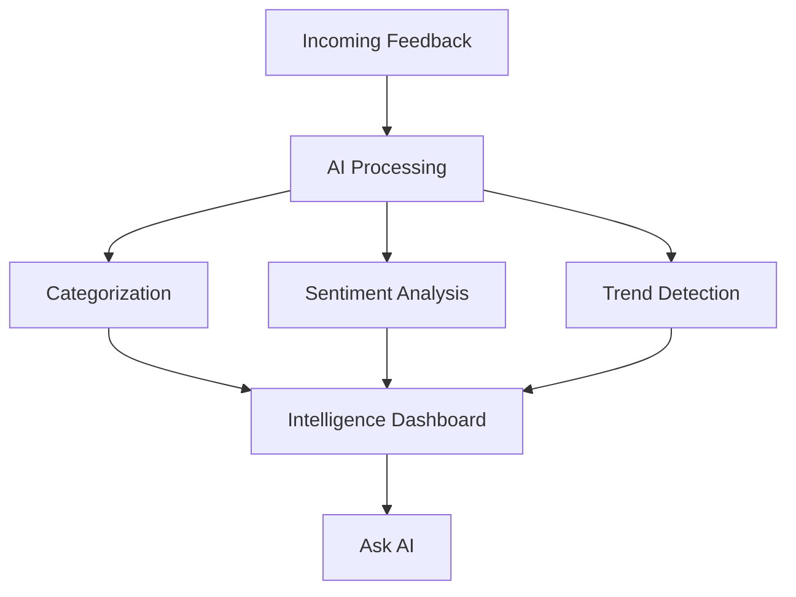

## AI-Powered Feedback Analysis

Feedback Intelligence is the analytical engine of ProductBridge. It takes the raw feedback flowing into your inbox and transforms it into structured, actionable insights — automatically and continuously.

Instead of manually reading hundreds of feedback items, you get AI-generated categories, sentiment scores, trend detection, and pattern recognition. This lets you focus on making decisions rather than sorting data.

## How It Works

When new feedback arrives, ProductBridge processes it through several AI layers:

1. **Categorization** — Each item is automatically tagged with relevant topics (e.g., Performance, UI/UX, Pricing, Onboarding)
2. **Sentiment Analysis** — Feedback is scored as positive, neutral, or negative so you understand how users feel
3. **Trend Detection** — ProductBridge identifies spikes in specific topics or sentiment shifts over time
4. **Deduplication** — Similar feedback items are grouped together so you see consolidated demand, not noise

<Callout kind="info">
  All AI processing happens automatically when feedback is received. You do not need to trigger analysis manually — your Intelligence Dashboard stays up to date in real time.
</Callout>

## Key Capabilities

<Columns cols={2}>
  <Card title="Ask AI" icon="sparkles" href="/core-concepts/feedback-intelligence/ask-ai">
    Ask natural language questions about your feedback data and get instant, AI-powered answers. Find out what users are asking for most, which segments are unhappy, or what changed this month.
  </Card>
  <Card title="Intelligence Dashboard" icon="bar-chart-3" href="/core-concepts/feedback-intelligence/dashboard">
    Explore visual analytics with trend charts, sentiment breakdowns, category distributions, and top-requested features — all updated in real time.
  </Card>
</Columns>

## From Insights to Action

Feedback Intelligence feeds directly into the [Product Roadmap](/core-concepts/product-roadmap). When you identify a high-demand feature or a recurring pain point, you can create a roadmap item directly from the intelligence view — with all the supporting feedback automatically linked.

This ensures every product decision is backed by real data, not guesswork.
