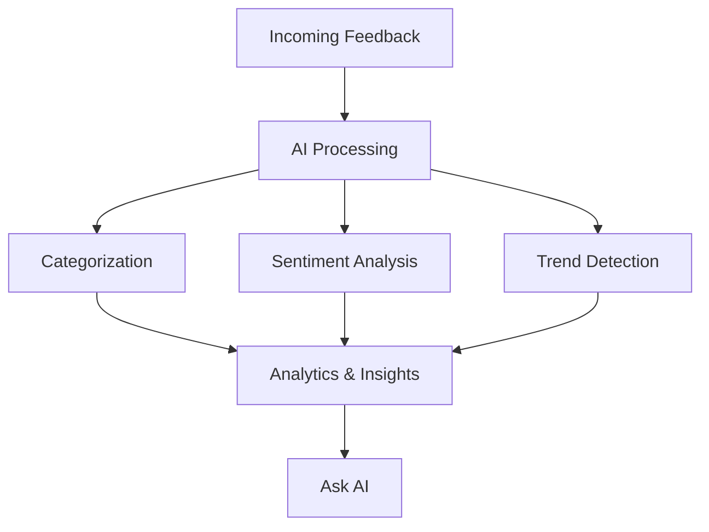

## Where to find it

<Card title="Open Insights" href="https://app.productbridge.io/dashboard/themes" icon="brain" horizontal="true">
  Sidebar → **Insights**
</Card>

**Direct link:** [https://app.productbridge.io/dashboard/themes](https://app.productbridge.io/dashboard/themes)

**In-app path:** Sidebar → **Insights**

**Requires:** `feedback_intelligence:view`, and a plan that includes Insights. Extraction must also be enabled at [Settings → Moderation → Feedback Intelligence](https://app.productbridge.io/dashboard/settings/moderation).

<Callout kind="info">
  The sidebar item is called **Insights**, and it opens the Themes view. The separate **Analytics** item above it opens the [overview dashboard](https://app.productbridge.io/dashboard/overview).
</Callout>

| Dashboard page | Sidebar item | Direct link |
|----------------|--------------|-------------|
| Analytics overview | **Analytics** | [`/dashboard/overview`](https://app.productbridge.io/dashboard/overview) |
| Themes | **Insights** | [`/dashboard/themes`](https://app.productbridge.io/dashboard/themes) |
| Observations | **Insights** → Observations tab | [`/dashboard/observations`](https://app.productbridge.io/dashboard/observations) |
| Strengths | **Insights** → Strengths tab | [`/dashboard/strengths`](https://app.productbridge.io/dashboard/strengths) |
| Ask AI | **Ask AI** | [`/dashboard/ask-ai`](https://app.productbridge.io/dashboard/ask-ai) |

## AI-Powered Feedback Analysis

Feedback Intelligence is the analytical engine of ProductBridge. It takes the raw feedback flowing into your inbox and transforms it into structured, actionable insights — automatically and continuously.

Instead of manually reading hundreds of feedback items, you get AI-generated categories, sentiment scores, trend detection, and pattern recognition. This lets you focus on making decisions rather than sorting data.

## How It Works

```mermaid
graph TD
    A[Incoming Feedback] --> B[AI Processing]
    B --> C[Categorization]
    B --> D[Sentiment Analysis]
    B --> E[Trend Detection]
    C --> F[Analytics & Insights]
    D --> F
    E --> F
    F --> G[Ask AI]
```

When new feedback arrives, ProductBridge processes it through several AI layers:

1. **Categorization** — Each item is automatically tagged with relevant topics (e.g., Performance, UI/UX, Pricing, Onboarding)
2. **Sentiment Analysis** — Feedback is scored as positive, neutral, or negative so you understand how users feel
3. **Trend Detection** — ProductBridge identifies spikes in specific topics or sentiment shifts over time
4. **Deduplication** — Similar feedback items are grouped together so you see consolidated demand, not noise

<Callout kind="info">
  All AI processing happens automatically when feedback is received. You do not need to trigger analysis manually — Analytics and Insights stay up to date in real time.
</Callout>

## Key Capabilities

<Columns cols={2}>
  <Card title="Ask AI" icon="sparkles" href="/core-concepts/feedback-intelligence/ask-ai">
    Ask natural language questions about your feedback data and get instant, AI-powered answers. Find out what users are asking for most, which segments are unhappy, or what changed this month.
  </Card>
  <Card title="Insights" icon="lightbulb" href="/core-concepts/insights">
    Turn feedback into ranked observations, themes, and strengths — each backed by evidence and updated in real time.
  </Card>
</Columns>

## From Insights to Action

Feedback Intelligence feeds directly into the [Product Roadmap](/core-concepts/product-roadmap). When you identify a high-demand feature or a recurring pain point, you can create a roadmap item directly from the intelligence view — with all the supporting feedback automatically linked.

This ensures every product decision is backed by real data, not guesswork.
