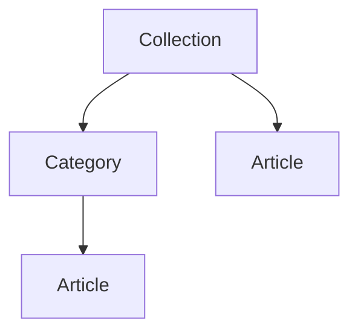

## Self-Serve Support for Your Users

The Help Center is your customer-facing knowledge base. Publish how-to guides, FAQs, and product documentation so users can answer their own questions before they ever open a support ticket. It deflects repetitive support volume, and it lives on the same public portal and in-app widget as your feedback, roadmap, and changelog — so everything your users need sits in one place.

You author articles from the dashboard and organize them into a browsable, searchable tree. Users read them on your portal, search by keyword, and tell you whether each article actually helped.

## How Content Is Organized

The Help Center uses a three-level structure so users can drill down from a broad topic to a specific answer:

| Level | Purpose | Example |
|-------|---------|---------|
| **Collection** | A top-level topic area shown on the Help Center home | "Getting Started", "Billing" |
| **Category** | A group of related articles inside a collection | "Setting up your account" |
| **Article** | A single piece of content with a rich-text body | "How to invite teammates" |

<Callout kind="info">
  A category always belongs to a collection, but an article can be filed **either** inside a category **or** directly inside a collection. Use direct-to-collection articles for standalone topics that do not need their own category.
</Callout>

## Building Your Help Center

<Steps>
  <Step title="Create a Collection" icon="folder">
    Open **Help Center** under **Modules** in the sidebar. In the taxonomy panel on the left, click **Add Collection** and give it a clear, high-level name such as "Getting Started". Collections are what users see first on the Help Center home page.
  </Step>
  <Step title="Add Categories (Optional)" icon="folder-tree">
    Inside a collection, add one or more categories to group related articles. Hover a collection in the sidebar and use its menu to add a category. Skip this step if a collection's articles do not need sub-grouping.
  </Step>
  <Step title="Write an Article" icon="file-text">
    Select a collection or category, then click **New Article**. The article editor opens as a side panel:

    - **Title** — A clear, question-shaped headline works best (e.g., "How do I reset my password?").
    - **Location** — Choose the parent collection, and optionally a category within it.
    - **Content** — Write the body in the rich-text editor. Headings, lists, links, images, and code blocks are all supported.
    - **Excerpt** — A short summary shown in article lists and search results. If you leave it blank, one is derived from the content.
  </Step>
  <Step title="Publish" icon="send">
    Set the status to **Published** and click **Save**. Published articles appear on your public Help Center immediately. Keep an article as a **Draft** while you are still working on it — drafts are visible only to your team.
  </Step>
</Steps>

## Draft and Published Status

Every article is either a **Draft** or **Published**. Change the status from the dropdown in the article editor at any time.

- **Draft** — Work in progress. Never shown to users; visible only inside the dashboard.
- **Published** — Live on your public Help Center and searchable by users.

<Callout kind="tip">
  Unpublishing is as simple as switching a Published article back to Draft. The article stays intact and disappears from the public portal until you publish it again.
</Callout>

## The Public Help Center

Your Help Center lives on your public portal's **Help** tab at `https://{your-subdomain}.productbridge.io/help`. Users land on a home page with a prominent search bar and a grid of collections, then drill down into categories and articles.

Every view has its own shareable URL, so you can link directly to any collection, category, or article:

| Page | URL |
|------|-----|
| Home | `https://{your-subdomain}.productbridge.io/help` |
| Search results | `https://{your-subdomain}.productbridge.io/help/search?q=QUERY` |
| Collection | `https://{your-subdomain}.productbridge.io/help/collection/COLLECTION_SLUG` |
| Category | `https://{your-subdomain}.productbridge.io/help/category/CATEGORY_SLUG` |
| Article | `https://{your-subdomain}.productbridge.io/help/article/ARTICLE_SLUG` |

Breadcrumbs on every page let users navigate back up the tree, and the search bar is always one click away.

## Keyword Search

Users search across your entire published library from the Help Center home. Search matches article **titles** and **content**, so a user does not need to know which collection an answer lives in — they type what they are looking for and jump straight to the article.

<Callout kind="info">
  Search only ever returns **published** articles. Drafts are never surfaced to users through search or direct links.
</Callout>

## "Was This Helpful?"

At the bottom of every article, users can rate whether it answered their question with a **Yes** or **No**. This gives you a direct signal about which articles are working and which need to be rewritten.

- Each user's vote is recorded once per article, and they can change or withdraw it.
- Helpful and not-helpful totals are aggregated per article, so you can spot low-performing content at a glance.

Use these signals to prioritize which articles to improve — a guide with a high "No" rate is a strong candidate for a rewrite.

## Enabling the Help Center

The Help Center is **off by default** on both your portal and your widget, so you can build out your content before it goes live. Turn it on when you are ready to publish.

<Tabs>
  <Tab title="Public Portal" icon="globe">
    Go to **Settings → Public Portal** and toggle **Help Center** on. The **Help** tab then appears in your portal navigation.
  </Tab>
  <Tab title="In-App Widget" icon="code">
    In your widget's **Configuration** settings, enable the **Help Center** tab. It then appears inside the embedded widget alongside your other tabs. You can also deep-link the widget straight to it with `defaultTab: 'helpcenter'`. See the [in-app widget](/core-concepts/feedback-collection/widgets) docs for embedding details.
  </Tab>
</Tabs>

<Callout kind="tip">
  You can author collections, categories, and articles programmatically — including from AI assistants — through the [MCP Server](/integrations/ai-assistants/mcp-server), which exposes tools to create, update, search, and delete Help Center content.
</Callout>
