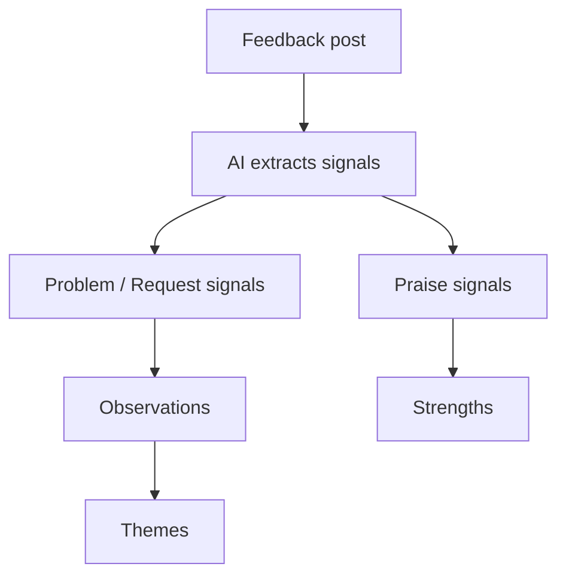

## Turn Feedback Into Decisions

Insights is the analytical layer of ProductBridge. As feedback arrives from every source, AI reads each item and distills it into structured, ranked insight — so instead of scrolling an endless inbox, you see the problems that affect the most people and the strengths users value most.

Every number in Insights is backed by **evidence** you can open with a click: the exact customer feedback behind each observation, theme, and strength.

## How Insights Works

When a feedback post arrives — from the public portal, an in-app widget, or an integration — ProductBridge breaks it into **signals**: the individual, atomic points the user is making. Each signal is one of three types:

- **Problem** — something broken, confusing, or missing
- **Request** — a capability the user wants
- **Praise** — something the user explicitly values

Signals then roll up into the Insights views:

- **Problems and requests** are grouped into **Observations** — one distinct issue each, deduplicated across every customer who raised it.
- Observations are organized under **Themes** — the broad functional areas of your product.
- **Praise** is grouped into **Strengths** — a flat list of what users love.

<Callout kind="info">
  Analysis is automatic and continuous. You never trigger it manually — Insights stays current as new feedback arrives.
</Callout>

## Key Concepts

### Reach and people

Observations and strengths are ranked by **reach** — the number of **distinct people** behind them, counting both the authors of the feedback and everyone who upvoted it. One person who appears in several posts is counted once, so reach reflects true demand, not raw volume.

### Status

Every observation, theme, and strength moves through a lifecycle:

| Status | Meaning |
|---|---|
| **Emerging** | Fewer than 2 distinct people so far — a new, unconfirmed signal |
| **Active** | 2 or more distinct people — a confirmed, recurring insight |
| **Dismissed** | Manually set aside as not actionable |
| **Resolved** | Addressed — the underlying problem has been handled |

### Evidence

Insight is never a black box. Select any row (or theme card) to open its **evidence** — the underlying signals and the source feedback posts they came from — so you can read the customer's own words and trace every count back to real input.

### Filters

Across Insights you can filter by **status**, **source** (Intercom, Slack, the public portal, and more), and **board**, and sort by reach, impact, or recency.

## Explore Insights

<Columns cols={2}>
  <Card title="Overview" icon="layout-dashboard" href="/core-concepts/insights/overview">
    The at-a-glance dashboard — feedback volume and trends across every source.
  </Card>
  <Card title="Themes" icon="book" href="/core-concepts/insights/themes">
    The highest-altitude stories — groups of related observations by product area.
  </Card>
  <Card title="Observations" icon="list" href="/core-concepts/insights/observations">
    The problems and requests showing up across the most feedback, ranked by reach.
  </Card>
  <Card title="Strengths" icon="heart" href="/core-concepts/insights/strengths">
    What users love, ranked by how many people value it.
  </Card>
</Columns>
