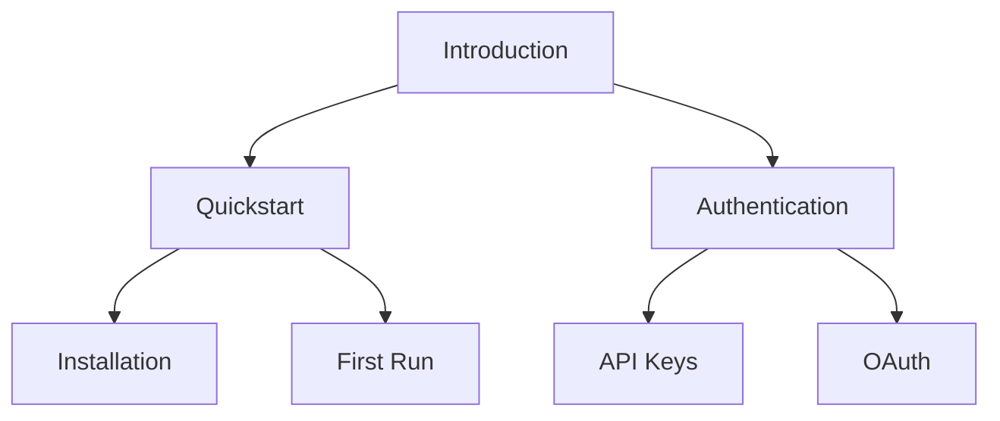

## Overview

ProductBridge provides powerful tools to create, organize, and maintain your documentation efficiently. You can build structured knowledge bases, collaborate in real-time, embed rich media, and customize every aspect to match your brand. These core features help teams produce high-quality docs without complexity.

<Columns cols={3}>
  <Card title="Document Structuring" icon="book-open" href="#document-structuring">
    Organize content with hierarchies, pages, and navigation.
  </Card>
  <Card title="Real-time Collaboration" icon="users" href="#collaboration">
    Edit together with live updates and version history.
  </Card>
  <Card title="Media Support" icon="image" href="#media">
    Embed images, videos, and interactive elements seamlessly.
  </Card>
  <Card title="Customization" icon="settings" href="#customization">
    Tailor themes, layouts, and components to your needs.
  </Card>
</Columns>

## Document Structuring and Hierarchies

Build intuitive documentation hierarchies with nested pages, sidebars, and search. ProductBridge supports unlimited nesting, so you create logical structures like `/docs/introduction` → `/docs/quickstart` → `/docs/api`.

<Callout kind="tip">
Use clear, descriptive slugs for URLs to improve SEO and navigation.
</Callout>

Follow these steps to set up your first hierarchy:

<Steps>
  <Step title="Create Root Page" icon="file">
    Start with an overview page in your workspace.
  </Step>
  <Step title="Add Nested Pages" icon="folder">
    Drag and drop to organize subtopics under parent pages.
  </Step>
  <Step title="Configure Sidebar" icon="menu">
    Enable automatic sidebar generation from your hierarchy.
  </Step>
</Steps>



## Real-time Collaboration Tools

Invite team members to edit docs simultaneously. Changes appear instantly, with cursor indicators and conflict resolution. Track history with blame view and rollback options.

<Tabs>
  <Tab title="Team Editing" icon="users">
    Share edit links or workspace access. See who is online and what they edit.

    <Callout kind="info">
      Up to 50 concurrent editors per doc for enterprise plans.
    </Callout>
  </Tab>
  <Tab title="Version Control" icon="git-branch">
    Commit changes with messages. Compare diffs side-by-side.
  </Tab>
</Tabs>

## Media and Embed Support

Enhance docs with images, videos, GIFs, and embeds. ProductBridge optimizes media automatically and supports lazy loading.

<Image
  src="https://via.placeholder.com/800x400/3B82F6/FFFFFF?text=Documentation+Screenshot"
  alt="ProductBridge editor with embedded media"
  width="800"
  height="400"
/>

Use standard embeds for third-party content:

````mdx
<Video src="https://www.youtube.com/embed/dQw4w9WgXcQ" title="Demo Video" width="560" height="315" />

<Iframe src="https://example.com/form" title="Interactive Form" width="100%" height="400" />
````

## Customization Options

Tailor your docs with themes, custom CSS, and MDX components. Set your brand color like `#3B82F6` and configure layouts.

<CodeGroup tabs="Theme Config,Custom Component">
  ```json
  {
    "theme": {
      "primaryColor": "#3B82F6",
      "fontFamily": "Inter, sans-serif"
    }
  }
  ```
  ```jsx
  // Custom MDX component example
  export const CustomCallout = ({ children, kind }) => (
    <div className={`callout-${kind}`}>
      {children}
    </div>
  );
  ```
</CodeGroup>

<Expandable title="Advanced Customization" default-open="false">
  Override defaults with CSS variables:

  ```css
  :root {
    --primary: #3B82F6;
    --sidebar-width: 280px;
  }
  ```

  Integrate via API for dynamic themes based on user preferences.
</Expandable>

| Feature | Basic Plan | Pro Plan | Enterprise |
|---------|------------|----------|------------|
| Custom Domains | No | Yes | Yes |
| CSS Overrides | Limited | Full | Full |
| Component Library | Standard | +Custom | Unlimited |

<Callout kind="success">
Ready to build? Check the [quickstart](/quickstart) for hands-on setup.
</Callout>