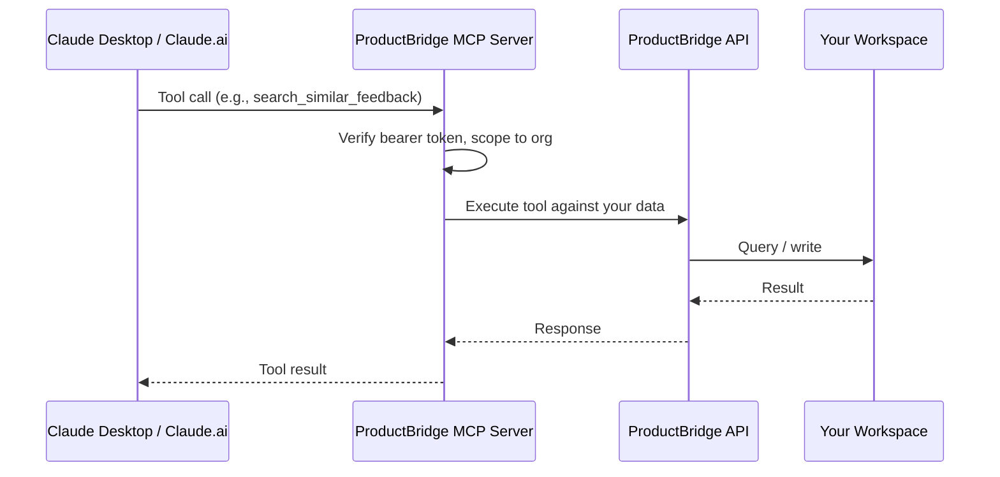

## What Is the MCP Server?

ProductBridge ships an **MCP (Model Context Protocol) Server** that exposes your workspace to AI assistants. Once connected, Claude can:

- Search and read feedback, roadmap items, and changelog entries
- Find semantically similar feedback ("anything else that sounds like this?")
- Create new feedback posts, roadmap items, and changelog entries
- Look up boards, statuses, tags, categories, and user segments
- Filter feedback by user segment ("what are Enterprise customers asking for?")
- Upvote feedback on behalf of a user

The connection is **bearer-token authenticated** and **scoped to your organization** — Claude only ever sees your workspace's data.

<Callout kind="info">
  MCP is an open protocol from Anthropic. While these docs focus on Claude Desktop and Claude.ai, the same connection works with any MCP-compatible client.
</Callout>

## How It Works



Claude calls a tool, the MCP server verifies your bearer token, scopes the call to your organization, runs it against your data, and streams the result back. No data leaves your workspace's boundary.

---

## Connect Claude in Three Steps

<Steps>
  <Step title="Generate your connection config" icon="key">
    In the ProductBridge admin, go to **Integrations → AI Assistants → MCP Server** and click **Generate Connection**.

    Optionally name the connection (e.g., "laptop" or "ci-pipeline") so you can identify it later in audit logs.

    ProductBridge generates:

    - A **bearer token** (shown once — copy it immediately)
    - The **MCP URL** to connect to
    - A **ready-to-paste config snippet** for Claude Desktop

    <Callout kind="alert">
      The bearer token is shown only once. Copy and store it securely. If you lose it, click **Rotate Key** to issue a fresh one — the old key becomes invalid immediately.
    </Callout>
  </Step>
  <Step title="Paste into your Claude client" icon="clipboard">
    <Tabs>
      <Tab title="Claude Desktop" icon="monitor">
        Open your Claude Desktop config file:

        - **macOS / Linux:** `~/.claude/claude_desktop_config.json`
        - **Windows:** `%APPDATA%\Claude\claude_desktop_config.json`

        Paste the config snippet ProductBridge generated:

        ```json
        {
          "mcpServers": {
            "productbridge": {
              "type": "http",
              "url": "https://api.productbridge.io/mcp",
              "headers": {
                "Authorization": "Bearer pb_your_token_here"
              }
            }
          }
        }
        ```

        Restart Claude Desktop for the change to take effect.
      </Tab>
      <Tab title="Claude.ai" icon="cloud">
        Open Claude.ai in your browser. Go to **Settings → Connected apps** and add a new MCP server.

        Paste the **MCP URL** and **bearer token** from ProductBridge into the connector form.

        Claude.ai picks up the connection immediately — no restart needed.
      </Tab>
      <Tab title="Other MCP clients" icon="terminal">
        Any client that speaks MCP can connect:

        - **Transport:** HTTP (stateless)
        - **URL:** the MCP URL ProductBridge provided
        - **Auth:** `Authorization: Bearer <your-token>` header

        That's all that's needed — point your client at the URL with the bearer header and the tools become available.
      </Tab>
    </Tabs>
  </Step>
  <Step title="Try it out" icon="sparkles">
    In Claude, try a prompt like:

    > "Use ProductBridge to list the top 10 feedback posts from Enterprise customers."

    Claude will call the appropriate MCP tools — you'll see the tool calls appear inline — and respond grounded in your real data.
  </Step>
</Steps>

---

## What Claude Can Do

The MCP Server exposes 27 tools across four areas. Claude picks the right ones automatically based on your prompt.

### Feedback

| Tool | What It Does |
|------|--------------|
| `get_feedback_list` | List feedback posts with filters (status, category, search, pagination) |
| `search_similar_feedback` | Semantic vector search — "find anything that sounds like this" |
| `get_feedback_by_segment` | List feedback posts from users in a specific segment |
| `create_feedback` | Create a new feedback post |
| `update_feedback` | Update title, description, board, status, category, or tags |
| `upvote_feedback` | Toggle an upvote on a post |

### Roadmap

| Tool | What It Does |
|------|--------------|
| `get_roadmap` | List roadmap items grouped by status |
| `create_roadmap_item` | Create a new roadmap item with title, description, ETA, effort, impact |

### Changelog

| Tool | What It Does |
|------|--------------|
| `get_changelog` | List changelog posts with status, type, and label filters |
| `create_changelog` | Create a new changelog entry (draft or published) |

### Configuration & Lookups

| Tool | What It Does |
|------|--------------|
| `list_feedback_boards` | List all feedback boards in your workspace |
| `list_roadmap_boards` | List all roadmap boards |
| `list_feedback_statuses` / `list_roadmap_statuses` | List available statuses |
| `list_feedback_categories` / `list_roadmap_categories` | List available categories |
| `list_feedback_tags` / `list_roadmap_tags` | List available tags |
| `list_changelog_status_codes` / `list_changelog_types` / `list_changelog_labels` | List changelog metadata |
| `list_user_segments` | List user segments — use these IDs with `get_feedback_by_segment` |

Claude reads the tool descriptions, decides which ones it needs, and composes them. You don't need to memorize the names — just ask in plain English.

---

## Example Conversations

<ExpandableGroup>
  <Expandable title="Triage from a customer email" default-open="false">
    > "I just got an email from a customer asking for dark mode. Can you check ProductBridge for similar requests and tell me how many votes the top match has?"

    Claude calls `search_similar_feedback` with your query, returns the top matches, and reports the vote counts.
  </Expandable>
  <Expandable title="Enterprise customer review" default-open="false">
    > "Pull the top 10 highest-voted open feedback from our Enterprise Customers segment and group them by category."

    Claude calls `list_user_segments` to find the Enterprise segment, then `get_feedback_by_segment` to fetch the posts, and groups the response itself.
  </Expandable>
  <Expandable title="Draft a changelog from a Slack thread" default-open="false">
    > "Here's a Slack thread about the new SSO update we just shipped: [paste]. Draft a changelog entry as a feature, label it Auth, save it as a draft."

    Claude calls `list_changelog_types` and `list_changelog_labels` to find the right values, then `create_changelog` with the drafted content.
  </Expandable>
  <Expandable title="Create a roadmap item from a meeting note" default-open="false">
    > "Add a roadmap item titled 'Workspace-level audit logs' on the Security board, effort 5, impact 8, ETA end of next quarter."

    Claude calls `list_roadmap_boards` to find the Security board, then `create_roadmap_item` with the specified fields.
  </Expandable>
</ExpandableGroup>

---

## Connection Management

### Rotate Your Token

If your token is exposed or you want to refresh it:

1. Go to **Integrations → AI Assistants → MCP Server**
2. Click **Rotate Key**

The old token is invalidated immediately. You'll need to update your Claude config with the new one.

### Last Used

Every successful tool call updates a **Last Used** timestamp on your connection, so you can tell at a glance whether a connection is still active.

### Multiple Connections

You can have multiple MCP connections per user (e.g., one for your laptop, one for a CI pipeline). Each gets its own token and audit trail.

---

## Scope & Security

| | Detail |
|---|--------|
| **Organization scope** | Every tool call is scoped to the organization the token belongs to. Claude can never see another workspace's data. |
| **Bearer token auth** | HTTP `Authorization: Bearer pb_...` header on every request |
| **Token storage** | Tokens are SHA-256 hashed and encrypted at rest. We never log raw tokens. |
| **Read + write** | MCP tools can create and update content. Rotate the token immediately if exposed. |
| **Audit trail** | Every tool call updates a `last_used_at` timestamp. Errors are logged with context. |

<Callout kind="alert">
  Treat your MCP bearer token like a production API key — never paste it into chats, screenshots, or commits. Rotate it immediately if it ends up somewhere it shouldn't.
</Callout>

---

## Troubleshooting

<ExpandableGroup>
  <Expandable title="Claude doesn't see the ProductBridge tools">
    - **Claude Desktop:** confirm you restarted the app after editing `claude_desktop_config.json`
    - **Claude.ai:** check the **Connected apps** page — the connector should show as active. Re-add it if not.
    - **Config syntax:** validate the JSON snippet — a missing comma or quote silently breaks tool discovery
    - **Token:** make sure the bearer token starts with `pb_` and matches exactly what ProductBridge generated (no leading whitespace)
  </Expandable>
  <Expandable title="Tools return 'Unauthorized' or 401">
    The bearer token isn't valid. Either:
    - You pasted a different token (check the `Authorization` header in your config)
    - The token has been rotated — generate a fresh one and update your config
    - The token was revoked manually from the connections list
  </Expandable>
  <Expandable title="Tools work but Claude doesn't pick them up automatically">
    Be explicit in your prompt — "Use the ProductBridge MCP server to ..." helps Claude pick the right tools when it's juggling several. After a couple of turns, Claude usually starts reaching for them without prompting.
  </Expandable>
  <Expandable title="Create or update tools fail">
    Check the error message — it usually tells you what's missing:

    - **Status / category / tag not found** — call the matching `list_*` tool first to get valid IDs
    - **Board not specified** — provide a `board_id` or rely on the workspace default
    - **Invalid date format** — `eta` on roadmap items must be `YYYY-MM-DD`
  </Expandable>
</ExpandableGroup>
