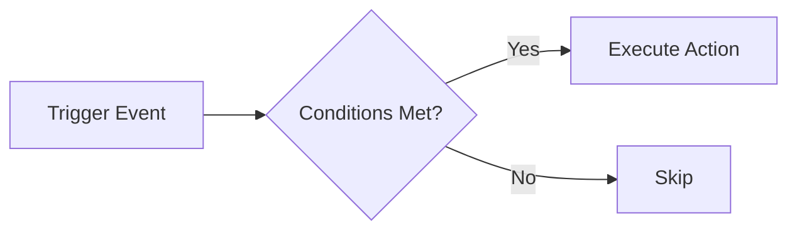

## Automate Your Product Workflow

Automations in ProductBridge let you define rules that trigger actions automatically when specific events occur. Reduce manual work, speed up response times, and keep your tools in sync without lifting a finger.

## How Automations Work

Every automation has three parts:

1. **Trigger** — The event that starts the automation (e.g., new feedback received, roadmap item status changed)
2. **Conditions** — Optional filters that narrow when the automation fires (e.g., only for feedback tagged "bug", only for enterprise customers)
3. **Action** — What happens when the trigger fires and conditions are met (e.g., send a Slack message, create a Jira issue, notify a team member)



## Creating an Automation

<Steps>
  <Step title="Open Automations" icon="workflow">
    Navigate to **Settings > Automations** in your project and click **New Automation**.
  </Step>
  <Step title="Choose a Trigger" icon="zap">
    Select the event that starts the automation:

    | Trigger | Description |
    |---------|-------------|
    | Feedback received | A new feedback item is submitted from any channel |
    | Feedback reaches vote threshold | A feedback item reaches a specified number of votes |
    | Roadmap item status changed | A roadmap item moves to a new status |
    | Changelog published | A new changelog entry is published |
    | Sentiment spike detected | AI detects a significant sentiment change |
  </Step>
  <Step title="Add Conditions (Optional)" icon="filter">
    Narrow when the automation fires. For example:

    - **Source** — Only trigger for feedback from Intercom
    - **Category** — Only trigger for feedback categorized as "Bug"
    - **Segment** — Only trigger for enterprise customers
    - **Sentiment** — Only trigger for negative feedback
  </Step>
  <Step title="Define the Action" icon="play">
    Choose what happens when the automation fires:

    - **Send Slack notification** — Post a message to a Slack channel
    - **Create issue** — Create a Jira, Linear, or Asana issue
    - **Send email** — Notify a team member or distribution list
    - **Update roadmap item** — Change status, add a tag, or adjust priority
    - **Webhook** — Send a payload to any URL for custom integrations
  </Step>
  <Step title="Activate" icon="check">
    Review the automation summary and click **Activate**. The automation starts running immediately for new events.
  </Step>
</Steps>

## Example Automations

<Tabs>
  <Tab title="Bug Alert" icon="alert-circle">
    **Trigger:** Feedback received
    **Condition:** Category equals "Bug" AND sentiment is negative
    **Action:** Send Slack message to #engineering-bugs

    ```json
    {
      "trigger": "feedback.received",
      "conditions": {
        "category": "Bug",
        "sentiment": "negative"
      },
      "action": {
        "type": "slack.send",
        "channel": "#engineering-bugs",
        "message": "New bug report: {feedback.title} — {feedback.url}"
      }
    }
    ```
  </Tab>
  <Tab title="Popular Request" icon="trending-up">
    **Trigger:** Feedback reaches 10 votes
    **Condition:** None
    **Action:** Create a Linear issue for review

    ```json
    {
      "trigger": "feedback.vote_threshold",
      "conditions": {
        "threshold": 10
      },
      "action": {
        "type": "linear.create_issue",
        "team": "Product",
        "title": "Review: {feedback.title}",
        "label": "user-requested"
      }
    }
    ```
  </Tab>
  <Tab title="Ship Notification" icon="megaphone">
    **Trigger:** Roadmap item status changed to "Completed"
    **Condition:** Item has linked feedback
    **Action:** Send email to all users who submitted linked feedback

    ```json
    {
      "trigger": "roadmap.status_changed",
      "conditions": {
        "new_status": "Completed",
        "has_linked_feedback": true
      },
      "action": {
        "type": "email.notify_voters",
        "subject": "A feature you requested just shipped!",
        "template": "feature_shipped"
      }
    }
    ```
  </Tab>
</Tabs>

## Managing Automations

- **Pause and resume** — Temporarily disable an automation without deleting it
- **Execution log** — View a history of every time the automation fired, including successes and failures
- **Duplicate** — Clone an existing automation and modify it for a different use case
- **Test mode** — Run an automation in test mode to preview the output without executing the action

<Callout kind="tip">
  Start with a few high-value automations (like bug alerts and popular request escalation) and expand as your team gets comfortable. Over-automating too early can create noise.
</Callout>

<Callout kind="info">
  Automations run in near real-time. Most actions execute within 30 seconds of the trigger event. Webhook actions include retry logic with exponential backoff for failed deliveries.
</Callout>
