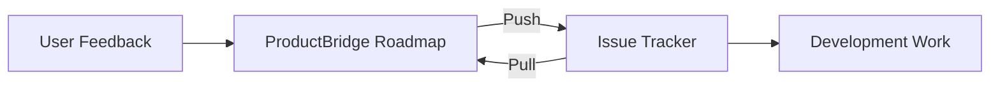

## Bridge Feedback and Development

ProductBridge integrates with the project management tools your engineering team already uses. Sync roadmap items to issues, link user feedback to development tasks, and keep both teams aligned without switching between platforms.

## Supported Tools

<Columns cols={3}>
  <Card title="Jira" icon="ticket" href="/integrations/jira">
    Sync with Atlassian Jira to link docs and feedback to Jira issues.
  </Card>
  <Card title="Linear" icon="layout" href="/integrations/linear">
    Connect Linear to track feedback alongside your development workflow.
  </Card>
  <Card title="Asana" icon="check-square" href="#asana">
    Link ProductBridge roadmap items to Asana tasks and projects.
  </Card>
</Columns>

## How It Works

When you connect a project management tool, ProductBridge enables a two-way sync between your roadmap and your issue tracker:

- **Roadmap → Issues** — When you create or update a roadmap item, a corresponding issue is created or updated in your issue tracker
- **Issues → Roadmap** — When an issue's status changes (e.g., moved to Done), the linked roadmap item updates automatically
- **Feedback Context** — Linked feedback items are visible in the issue description or as comments, so developers understand the user need behind every task

## Jira

The Jira integration supports Jira Cloud and Jira Data Center. You can link documentation pages, sync issue statuses, and configure bidirectional webhooks.

<Card title="Jira Integration Guide" icon="ticket" href="/integrations/jira">
  See the full setup guide, sync configuration, and webhook details for the Jira integration.
</Card>

## Linear

The Linear integration connects via OAuth and supports issues, labels, cycles, and comments. Automate issue creation when feedback reaches a threshold or roadmap items change status.

<Card title="Linear Integration Guide" icon="layout" href="/integrations/linear">
  See the full setup guide, automation recipes, and webhook details for the Linear integration.
</Card>

## Asana

Connect ProductBridge to Asana to sync roadmap items with Asana tasks.

<Steps>
  <Step title="Connect Asana" icon="link">
    Navigate to **Settings > Integrations > Asana** and click **Connect**. Authorize ProductBridge via OAuth to access your Asana workspace.
  </Step>
  <Step title="Select a Project" icon="folder">
    Choose the Asana project where ProductBridge should create and sync tasks. You can map multiple ProductBridge projects to different Asana projects.
  </Step>
  <Step title="Configure Field Mapping" icon="columns">
    Map ProductBridge fields to Asana fields:

    | ProductBridge | Asana |
    |--------------|-------|
    | Roadmap item title | Task name |
    | Description | Task description |
    | Status | Section (e.g., To Do, In Progress, Done) |
    | Priority | Custom field or tag |
  </Step>
  <Step title="Enable Sync" icon="refresh-cw">
    Toggle on bidirectional sync. Changes in either platform are reflected in the other within minutes.
  </Step>
</Steps>

<Callout kind="info">
  All project management integrations support bidirectional sync by default. You can configure them as one-way (push or pull only) in the integration settings if needed.
</Callout>

## Shared Capabilities

All project management integrations share these features:

- **Status mapping** — Map your roadmap statuses to your issue tracker's workflow states
- **Automatic linking** — When a roadmap item is pushed to an issue tracker, the link is stored in both systems
- **Feedback forwarding** — User feedback linked to a roadmap item is included in the issue description or as a comment
- **Notification sync** — Status changes in the issue tracker trigger notifications in ProductBridge for stakeholders following the roadmap item
