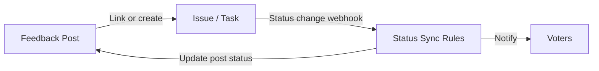

## Bridge Feedback and Development

ProductBridge integrates with the project management tools your engineering team already uses. Link feedback posts to the issues that implement them, create new issues pre-filled from a post, and let status changes in your tracker update the post — and notify its voters — automatically.

## Supported Tools

<Columns cols={3}>
  <Card title="Jira" icon="ticket" href="/integrations/project-management/jira">
    Link feedback posts to Jira Cloud issues and sync issue statuses back.
  </Card>
  <Card title="Linear" icon="layout" href="/integrations/project-management/linear">
    Link feedback posts to Linear issues across your teams and workflow states.
  </Card>
  <Card title="ClickUp" icon="check-square" href="/integrations/project-management/clickup">
    Link feedback posts to ClickUp tasks and sync task statuses back.
  </Card>
</Columns>

## How It Works

Project management integrations link **feedback posts** to issues or tasks in your tracker. They do not push roadmap items or import issues as feedback — linking is always initiated from a feedback post.

- **Link from a post** — Open any feedback post, search your tracker, and link an existing issue in one click
- **Create from a post** — Create a new issue pre-filled from the post, directly in the tracker project or team you choose
- **Status sync rules** — When a linked issue's status changes, rules you define update the post's status (for example, issue moves to *Done* → post becomes *Complete*)
- **Voter notifications** — Each rule can optionally notify everyone who voted for the post when it fires

## Shared Capabilities

All project management integrations share these features:

- **OAuth connection** — Authorize once from **Connect Sources**; no API keys to manage
- **Search, link, and create** — Attach existing issues or create new ones without leaving the feedback post
- **Status sync rules** — Sentence-style rules with **any/all** matching across multiple linked issues, a target post status, and an optional voter notification
- **Real-time updates** — Trackers deliver status changes via webhooks, so posts update without polling

<Callout kind="info">
  Status sync direction is fixed: changes flow from your tracker into ProductBridge post statuses. Linking or unlinking never modifies the issue in your tracker.
</Callout>
