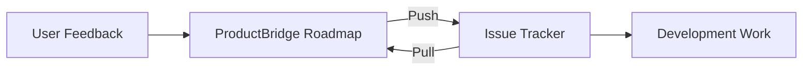

## Bridge Feedback and Development

ProductBridge integrates with the project management tools your engineering team already uses. Sync roadmap items to issues, link user feedback to development tasks, and keep both teams aligned without switching between platforms.

## Supported Tools

<Columns cols={2}>
  <Card title="Jira" icon="ticket" href="/integrations/project-management/jira">
    Sync with Atlassian Jira to link feedback to Jira issues.
  </Card>
  <Card title="Linear" icon="layout" href="/integrations/project-management/linear">
    Connect Linear to track feedback alongside your development workflow.
  </Card>
</Columns>

## How It Works

When you connect a project management tool, ProductBridge enables a two-way sync between your roadmap and your issue tracker:

- **Roadmap to Issues** — When you create or update a roadmap item, a corresponding issue is created or updated in your issue tracker
- **Issues to Roadmap** — When an issue's status changes (e.g., moved to Done), the linked roadmap item updates automatically
- **Feedback Context** — Linked feedback items are visible in the issue description or as comments, so developers understand the user need behind every task

## Shared Capabilities

All project management integrations share these features:

- **Status mapping** — Map your roadmap statuses to your issue tracker's workflow states
- **Automatic linking** — When a roadmap item is pushed to an issue tracker, the link is stored in both systems
- **Feedback forwarding** — User feedback linked to a roadmap item is included in the issue description or as a comment
- **Notification sync** — Status changes in the issue tracker trigger notifications in ProductBridge for stakeholders following the roadmap item

<Callout kind="info">
  All project management integrations support bidirectional sync by default. You can configure them as one-way (push or pull only) in the integration settings if needed.
</Callout>
