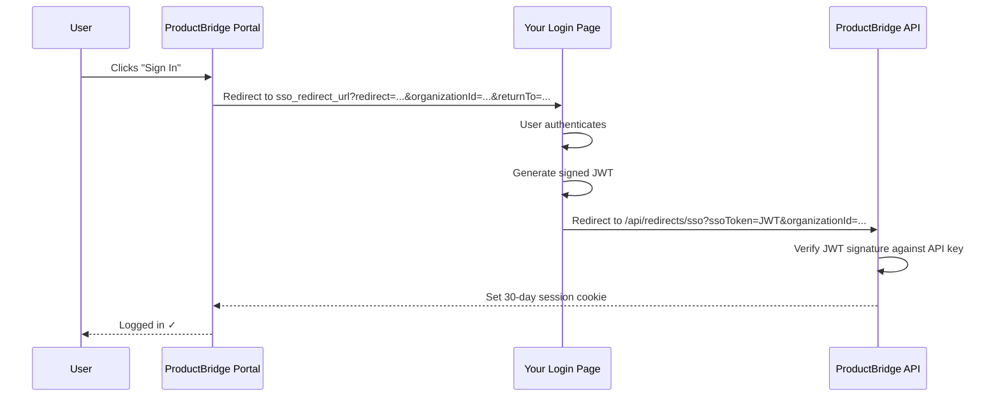

## Overview

ProductBridge SSO uses a **redirect-based JWT flow**. When a user visits your portal and clicks Sign In, ProductBridge sends them to your login page. After they authenticate, your server generates a signed JWT and redirects them back. ProductBridge verifies the token and creates an authenticated session.

<Image src="/images/sso-overview-placeholder.png" width="960" height="480" alt="SSO settings page showing the three-step configuration wizard with redirect URL input, test button, and enable toggle" />

<Columns cols="2">
  <Card title="SSO Redirect" href="#configure-sso-redirect" icon="shield" horizontal={false}>
    Set your login page URL, test the full redirect flow, and enable SSO for your portal.
  </Card>
  <Card title="Widget Auth" href="#widget-auth-settings" icon="fingerprint" horizontal={false}>
    Lock the in-app widget to identified users only and enforce HMAC hash verification.
  </Card>
</Columns>

## How It Works



1. **User clicks Sign In** on your ProductBridge portal
2. **ProductBridge redirects** to your configured login page with `redirect`, `organizationId`, and `returnTo` query parameters
3. **Your server authenticates** the user and generates a signed JWT
4. **Your server redirects** back to the ProductBridge SSO callback with `ssoToken` and `organizationId`
5. **ProductBridge verifies** the JWT signature and creates a 30-day session

<Callout kind="info">
  The JWT is signed with your **Widget API Secret** — the same key used for widget identity verification. Your secret never leaves your server.
</Callout>

---

## Configure SSO Redirect

Go to **Settings → Security → SSO Redirect** to configure the three steps below.

<Image src="/images/sso-redirect-tab-placeholder.png" width="960" height="600" alt="SSO Redirect tab showing three steps: redirect URL input, test redirect button, and enable SSO toggles" />

### Step 1 — Set Your Redirect URL

Enter the URL of your login page. This is the page on your application where users will be sent when they click Sign In on your portal.

```
https://yourapp.com/login
```

ProductBridge appends these query parameters when redirecting to your login page:

| Parameter | Description |
|---|---|
| `redirect` | The ProductBridge SSO callback URL to redirect back to after login |
| `organizationId` | Your ProductBridge organization ID |
| `returnTo` | The portal page the user was trying to reach |

Your login page should read these parameters, authenticate the user, generate a JWT, and redirect to `redirect?ssoToken=JWT&organizationId=organizationId`.

### Step 2 — Test the Redirect Flow

Click **Test Redirect Flow** to verify the complete loop before going live. ProductBridge opens a popup, sends a test request to your login page, and waits for a valid JWT callback.

<Image src="/images/sso-test-flow-placeholder.png" width="960" height="400" alt="SSO test popup showing a pending test with the test URL and waiting for callback status" />

<Steps>
  <Step title="Click Test Redirect Flow" icon="play" title-type="p">
    ProductBridge opens a popup window and redirects to your configured login page with `test=true` appended to the query parameters.
  </Step>
  <Step title="Complete authentication in the popup" icon="log-in" title-type="p">
    Your login page receives the request, authenticates the test, and sends a JWT back to the ProductBridge callback URL.
  </Step>
  <Step title="See the result" icon="check-circle" title-type="p">
    If the JWT is valid, the popup closes and the **SSO Tested** badge turns green. If verification fails, an error message describes what went wrong.
  </Step>
</Steps>

<Callout kind="alert">
  You must complete a successful test before you can enable SSO. The **Enable SSO** toggle is locked until the test passes.
</Callout>

### Step 3 — Enable SSO

After a successful test, two toggles become available:

<Image src="/images/sso-enable-toggles-placeholder.png" width="960" height="280" alt="Two toggle switches: Enable Single Sign-On Redirect and Disable ProductBridge Login" />

**Enable Single Sign-On Redirect** — When on, all portal Sign In clicks redirect to your login page instead of showing the ProductBridge login form.

**Disable ProductBridge Login** — When on, the native ProductBridge login form is hidden entirely. Users can only sign in via your SSO redirect. Enable this only after confirming SSO works correctly.

<Callout kind="danger">
  Enabling "Disable ProductBridge Login" locks out all users who previously signed in with a ProductBridge password. Make sure SSO is fully working before turning this on. You can always disable SSO from the dashboard to restore access.
</Callout>

---

## Generate the SSO JWT

Your login page must generate a signed JWT and redirect back to ProductBridge. Sign the token with your **Widget API Secret** using `HS256`.

### Get Your API Secret

Go to **Settings → Security → API Keys**, click **Generate API Key**, and copy the secret. Store it in your server environment — it is shown only once.

```bash
PRODUCTBRIDGE_WIDGET_SECRET=your_64_char_hex_secret
```

### Generate the JWT

<CodeGroup tabs="Node.js, Python, PHP, Ruby, Go">
```javascript title="sso-callback.js (Express)"
const jwt = require('jsonwebtoken');
// npm install jsonwebtoken

const PRODUCTBRIDGE_SECRET = process.env.PRODUCTBRIDGE_WIDGET_SECRET;

// Called after your own auth succeeds
function handleSSOCallback(req, res) {
  const { redirect, organizationId, returnTo } = req.query;
  const user = req.user; // your authenticated user

  const token = jwt.sign(
    {
      // Required
      email: user.email,

      // Recommended
      name: user.name,
      id: String(user.id),
      avatarURL: user.avatarUrl,

      // Optional: company & plan data
      company_name: user.companyName,
      company_id: String(user.companyId),
      company_mrr: user.mrr,
      customer_status: user.status,     // "active" | "trial" | "churned"
      renewal_date: user.renewalDate,   // ISO date string
      renewal_risk: user.renewalRisk,   // "low" | "medium" | "high"
    },
    PRODUCTBRIDGE_SECRET,
    { expiresIn: '1h', algorithm: 'HS256' }
  );

  // Redirect back to ProductBridge
  const callbackUrl = new URL(redirect);
  callbackUrl.searchParams.set('ssoToken', token);
  callbackUrl.searchParams.set('organizationId', organizationId);
  if (returnTo) callbackUrl.searchParams.set('returnTo', returnTo);

  res.redirect(callbackUrl.toString());
}
```

```python title="sso_callback.py (Flask / Django)"
import jwt
import os
from datetime import datetime, timedelta, timezone
# pip install PyJWT

PRODUCTBRIDGE_SECRET = os.environ['PRODUCTBRIDGE_WIDGET_SECRET']

def handle_sso_callback(request):
    redirect_url = request.args.get('redirect')
    organization_id = request.args.get('organizationId')
    return_to = request.args.get('returnTo')
    user = current_user  # your authenticated user

    payload = {
        # Required
        'email': user.email,

        # Recommended
        'name': user.name,
        'id': str(user.id),
        'avatarURL': user.avatar_url,

        # Optional: company & plan data
        'company_name': user.company_name,
        'company_id': str(user.company_id) if user.company_id else None,
        'company_mrr': user.mrr,
        'customer_status': user.status,
        'renewal_date': user.renewal_date,
        'renewal_risk': user.renewal_risk,

        # Token lifetime
        'exp': datetime.now(tz=timezone.utc) + timedelta(hours=1),
    }

    token = jwt.encode(payload, PRODUCTBRIDGE_SECRET, algorithm='HS256')

    from urllib.parse import urlparse, urlencode, parse_qs
    import urllib.parse

    params = {'ssoToken': token, 'organizationId': organization_id}
    if return_to:
        params['returnTo'] = return_to

    callback = f"{redirect_url}?{urlencode(params)}"
    return redirect(callback)
```

```php title="SSOController.php (Laravel)"
<?php
use Firebase\JWT\JWT;
// composer require firebase/php-jwt

class SSOController extends Controller
{
    public function callback(Request $request): \Illuminate\Http\RedirectResponse
    {
        $redirectUrl    = $request->query('redirect');
        $organizationId = $request->query('organizationId');
        $returnTo       = $request->query('returnTo');
        $user           = $request->user();

        $payload = array_filter([
            // Required
            'email'           => $user->email,

            // Recommended
            'name'            => $user->name,
            'id'              => (string) $user->id,
            'avatarURL'       => $user->avatar_url,

            // Optional
            'company_name'    => $user->company_name,
            'company_id'      => $user->company_id ? (string) $user->company_id : null,
            'company_mrr'     => $user->mrr,
            'customer_status' => $user->status,
            'renewal_date'    => $user->renewal_date,
            'renewal_risk'    => $user->renewal_risk,

            'exp'             => time() + 3600,
        ]);

        $token = JWT::encode($payload, env('PRODUCTBRIDGE_WIDGET_SECRET'), 'HS256');

        $params = http_build_query(array_filter([
            'ssoToken'       => $token,
            'organizationId' => $organizationId,
            'returnTo'       => $returnTo,
        ]));

        return redirect("{$redirectUrl}?{$params}");
    }
}
```

```ruby title="sso_controller.rb (Rails)"
require 'jwt'

class SSOController < ApplicationController
  def callback
    redirect_url    = params[:redirect]
    organization_id = params[:organizationId]
    return_to       = params[:returnTo]
    user            = current_user

    payload = {
      # Required
      email: user.email,

      # Recommended
      name: user.name,
      id: user.id.to_s,
      avatarURL: user.avatar_url,

      # Optional
      company_name: user.company_name,
      company_id: user.company_id&.to_s,
      company_mrr: user.mrr,
      customer_status: user.status,
      renewal_date: user.renewal_date,
      renewal_risk: user.renewal_risk,

      exp: 1.hour.from_now.to_i,
    }.compact

    token = JWT.encode(payload, ENV['PRODUCTBRIDGE_WIDGET_SECRET'], 'HS256')

    query = { ssoToken: token, organizationId: organization_id, returnTo: return_to }.compact
    redirect_to "#{redirect_url}?#{query.to_query}"
  end
end
```

```go title="sso_handler.go"
package handlers

import (
    "net/http"
    "net/url"
    "os"
    "time"

    "github.com/golang-jwt/jwt/v5"
)

var secret = []byte(os.Getenv("PRODUCTBRIDGE_WIDGET_SECRET"))

type SSOClaims struct {
    Email          string  `json:"email"`
    Name           string  `json:"name,omitempty"`
    ID             string  `json:"id,omitempty"`
    AvatarURL      string  `json:"avatarURL,omitempty"`
    CompanyName    string  `json:"company_name,omitempty"`
    CompanyID      string  `json:"company_id,omitempty"`
    CompanyMRR     float64 `json:"company_mrr,omitempty"`
    CustomerStatus string  `json:"customer_status,omitempty"`
    RenewalDate    string  `json:"renewal_date,omitempty"`
    RenewalRisk    string  `json:"renewal_risk,omitempty"`
    jwt.RegisteredClaims
}

func SSOCallback(w http.ResponseWriter, r *http.Request) {
    q           := r.URL.Query()
    redirectURL := q.Get("redirect")
    orgID       := q.Get("organizationId")
    returnTo    := q.Get("returnTo")
    user        := userFromContext(r.Context())

    claims := SSOClaims{
        Email:          user.Email,
        Name:           user.Name,
        ID:             user.ID,
        AvatarURL:      user.AvatarURL,
        CompanyName:    user.CompanyName,
        CompanyID:      user.CompanyID,
        CompanyMRR:     user.MRR,
        CustomerStatus: user.Status,
        RenewalDate:    user.RenewalDate,
        RenewalRisk:    user.RenewalRisk,
        RegisteredClaims: jwt.RegisteredClaims{
            ExpiresAt: jwt.NewNumericDate(time.Now().Add(time.Hour)),
            IssuedAt:  jwt.NewNumericDate(time.Now()),
        },
    }

    token, _ := jwt.NewWithClaims(jwt.SigningMethodHS256, claims).SignedString(secret)

    cb, _ := url.Parse(redirectURL)
    p := url.Values{"ssoToken": {token}, "organizationId": {orgID}}
    if returnTo != "" {
        p.Set("returnTo", returnTo)
    }
    cb.RawQuery = p.Encode()

    http.Redirect(w, r, cb.String(), http.StatusFound)
}
```
</CodeGroup>

### JWT Payload Reference

| Field | Type | Required | Description |
|---|---|---|---|
| `email` | string | **Yes** | User's email — used as the primary identity anchor |
| `name` | string | Recommended | Display name shown in the ProductBridge dashboard |
| `id` | string | Recommended | Your internal user ID for deduplication |
| `avatarURL` | string | No | Profile picture URL |
| `company_name` | string | No | User's company name |
| `company_id` | string | No | Your internal company / account ID |
| `company_mrr` | number | No | Monthly recurring revenue in USD |
| `customer_status` | string | No | `active`, `trial`, `churned`, or any custom value |
| `renewal_date` | string | No | ISO date string of the next renewal |
| `renewal_risk` | string | No | `low`, `medium`, or `high` |
| `account_owner_id` | string | No | Internal ID of the account owner or CSM |
| `account_owner_email` | string | No | Email of the account manager or CSM |
| `external_user_id` | string | No | Any external system ID (CRM, Salesforce, etc.) |

<Callout kind="info">
  Only `email` is required. Start there and add company and plan fields later when you want user segmentation and revenue-weighted prioritization in your dashboard.
</Callout>

---

## Widget Auth Settings

Go to **Settings → Security → Widget Auth** to control how the in-app widget handles user identity.

<Image src="/images/sso-widget-auth-placeholder.png" width="960" height="400" alt="Widget Auth tab showing three toggle settings: require identify, require user hash, and identify mode selector" />

### Require identify() for Widget

When enabled, anonymous users see a locked state in the widget instead of the default feedback form. The widget only accepts submissions from users who have been identified via `ProductBridge.init({ userToken })` or `ProductBridge.identify(token)`.

Use this when you want every piece of widget feedback linked to a verified user account.

### Require User Hash

When enabled, ProductBridge also validates an HMAC-SHA256 hash of the user ID included in the JWT. This prevents a user from crafting a token that impersonates another user — even if they somehow obtain a valid API secret.

Generate the hash on your server and include it in the JWT payload:

```javascript title="Adding user hash to JWT"
const crypto = require('crypto');

const userHash = crypto
  .createHmac('sha256', process.env.PRODUCTBRIDGE_WIDGET_SECRET)
  .update(String(user.id))
  .digest('hex');

// Include user_hash in your JWT payload
jwt.sign(
  { email: user.email, id: String(user.id), user_hash: userHash },
  PRODUCTBRIDGE_SECRET,
  { expiresIn: '1h' }
);
```

### Identify Mode

Controls what happens when the widget receives an `identify()` call for a user who does not exist in ProductBridge yet.

| Mode | Behavior |
|---|---|
| **Upsert** (default) | Creates a new user record if the email is not found. Use for self-serve products where any authenticated user can submit feedback. |
| **Update Only** | Rejects identify calls for unknown emails. Use when you want to restrict widget feedback to a pre-imported user list only. |

---

## Portal Auth Methods

Go to **Settings → Security → Portal** to see the SSO callback URL and your portal URL.

<Image src="/images/sso-portal-info-placeholder.png" width="960" height="320" alt="Portal tab showing the portal URL and SSO callback URL with copy buttons" />

| Field | Value |
|---|---|
| **Portal URL** | Your public portal address (subdomain or custom domain) |
| **SSO Callback URL** | The URL your login page redirects back to — always `/api/redirects/sso` on your portal host |

Copy the **SSO Callback URL** and allowlist it on your OAuth provider or CSRF whitelist if your login system enforces origin checking.

---

## Troubleshooting

<ExpandableGroup>
  <Expandable title="Test says 'Token verification failed'" default-open="false">
    The JWT signature did not match. Check that the secret used to sign the token matches the API key displayed in **Settings → Security → API Keys**. The key is only shown once — if you are unsure, generate a new one and update your server environment variable.
  </Expandable>

  <Expandable title="SSO redirect loop — users keep getting sent back to my login page" default-open="false">
    Your login page is not returning a valid JWT callback. Check:

    - The `redirect` query parameter is forwarded to your callback URL exactly as received
    - `ssoToken` and `organizationId` are both included in the redirect back to ProductBridge
    - The JWT `exp` claim is set to a future time (tokens expire after 1 hour)
    - Your server clock is synchronized — tokens issued in the future are rejected
  </Expandable>

  <Expandable title="Users are created as new accounts on every login" default-open="false">
    ProductBridge uses `email` as the identity anchor. If the email value in the JWT changes between sessions (for example, `user@example.com` vs `User@Example.com`), a new record is created. Send a consistent, lowercased canonical email every time.
  </Expandable>

  <Expandable title="'Disable ProductBridge Login' locked me out" default-open="false">
    If SSO breaks after you disabled native login, you can restore access by contacting support at `help@productbridge.io`. Provide your organization ID and they can re-enable the fallback login from the backend.

    To avoid this, always test SSO thoroughly before enabling "Disable ProductBridge Login".
  </Expandable>

  <Expandable title="Widget shows 'Please log in' even after passing a userToken" default-open="false">
    The most common cause is a signature mismatch. Verify that `PRODUCTBRIDGE_WIDGET_SECRET` on your server matches the key in **Settings → Security → API Keys**. Also confirm you are using the `HS256` algorithm — other algorithms are not accepted.
  </Expandable>
</ExpandableGroup>
