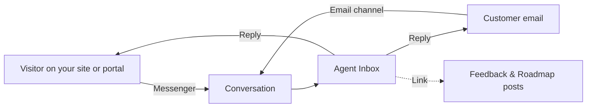

## Overview

Support Chat turns ProductBridge into a full customer-conversation platform. Your customers write to you through the **Messenger** — a floating chat panel on your public portal or embedded on any website — or by **email**, and every conversation lands in one **Agent Inbox** inside your dashboard.

Because it lives next to your feedback boards, roadmap, and changelog, Support Chat does things a standalone help desk can't:

- **Conversations link to feedback.** Attach a support thread to the feedback or roadmap post it's really about, and see a contact's posts, votes, and comments right beside their messages.

- **The messenger is more than chat.** Its tabs surface your changelog (News), your public roadmap with voting, and your help center — so many questions answer themselves before they reach your team.

- **AI does the busywork.** One click summarizes a long thread for whoever picks it up next, and resolved conversations become searchable memory that powers "similar conversations."

{/* SCREENSHOT PLACEHOLDER — images/support-chat/inbox-overview.png
    Capture: the Agent Inbox with a real conversation open (list + thread + details rail).
    <Image src="https://raw.githubusercontent.com/hvemasan/documentationai-starter-kit/main/images/support-chat/inbox-overview.png" width="1865" height="940" alt="The Support Chat agent inbox with the views rail, conversation list, thread, and details rail" /> */}

## How It Fits Together

A conversation keeps its channel identity — live chat replies appear instantly in the messenger, email replies go back out over email — but agents work every thread the same way, in the same inbox.

## Explore Support Chat

<Columns cols="2">
  <Card title="The Messenger" href="/support-chat/messenger" icon="messages-square">
    The customer-facing chat panel: its five tabs, guest visitors, theming, and languages.
  </Card>

  <Card title="Agent Inbox" href="/support-chat/agent-inbox" icon="inbox">
    Views, filters, the composer, keyboard shortcuts, and the details rail — your team's daily workspace.
  </Card>

  <Card title="Messenger Settings" href="/support-chat/messenger-settings" icon="settings-2">
    Customize appearance and content, control who can start conversations, and install the messenger on your site.
  </Card>

  <Card title="Email Channel" href="/support-chat/email-channel" icon="mail">
    Route your support address into the same inbox — forwarding or IMAP/SMTP.
  </Card>

  <Card title="Teams, Macros & Labels" href="/support-chat/teams-macros-labels" icon="users">
    Organize your support workspace: routing to teams, canned replies, and labels.
  </Card>

  <Card title="SLA & Reports" href="/support-chat/sla-and-reports" icon="chart-no-axes-column">
    Response-time policies, the reports view, and customer satisfaction scores.
  </Card>
</Columns>

## Who Can Use It

Support Chat uses two permission levels:

| Permission | What it allows |
|---|---|
| `support:view` | See the Support module, read conversations, and browse reports. |
| `support:manage` | Reply, assign, change status and priority, edit labels, and manage support settings. |

Members without either permission don't see the Support module at all. Learn more about roles in [Members & Roles](/settings/members-and-roles).

<Callout kind="tip" collapsed="false">
  Start with the [Messenger Settings](/support-chat/messenger-settings) page to get the messenger installed and styled, then invite your team and set up [Teams, Macros & Labels](/support-chat/teams-macros-labels) once real conversations start flowing.
</Callout>
